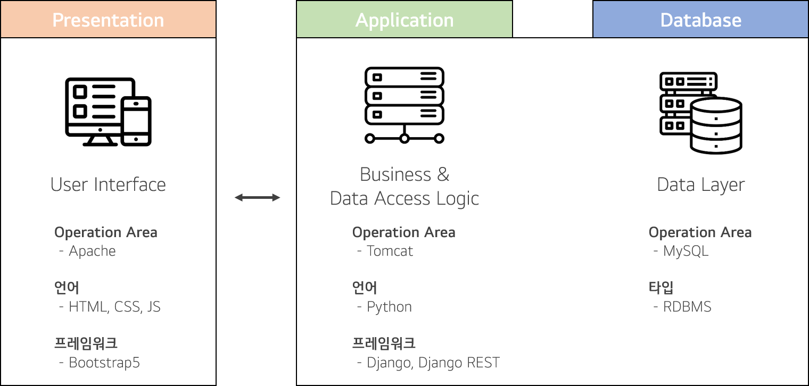
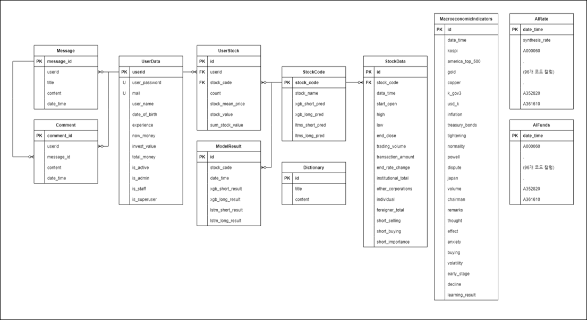
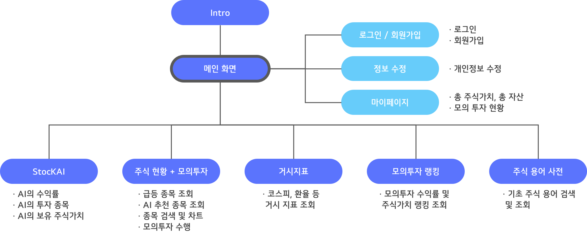
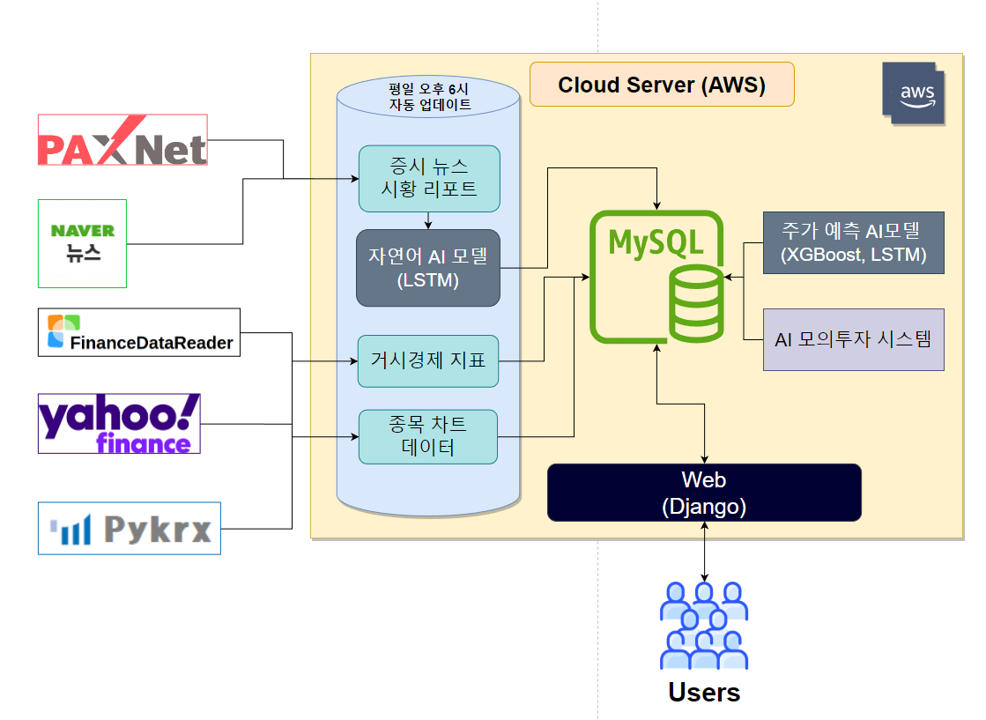
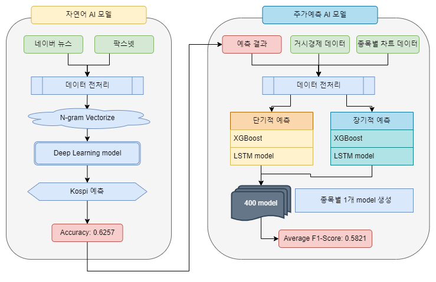
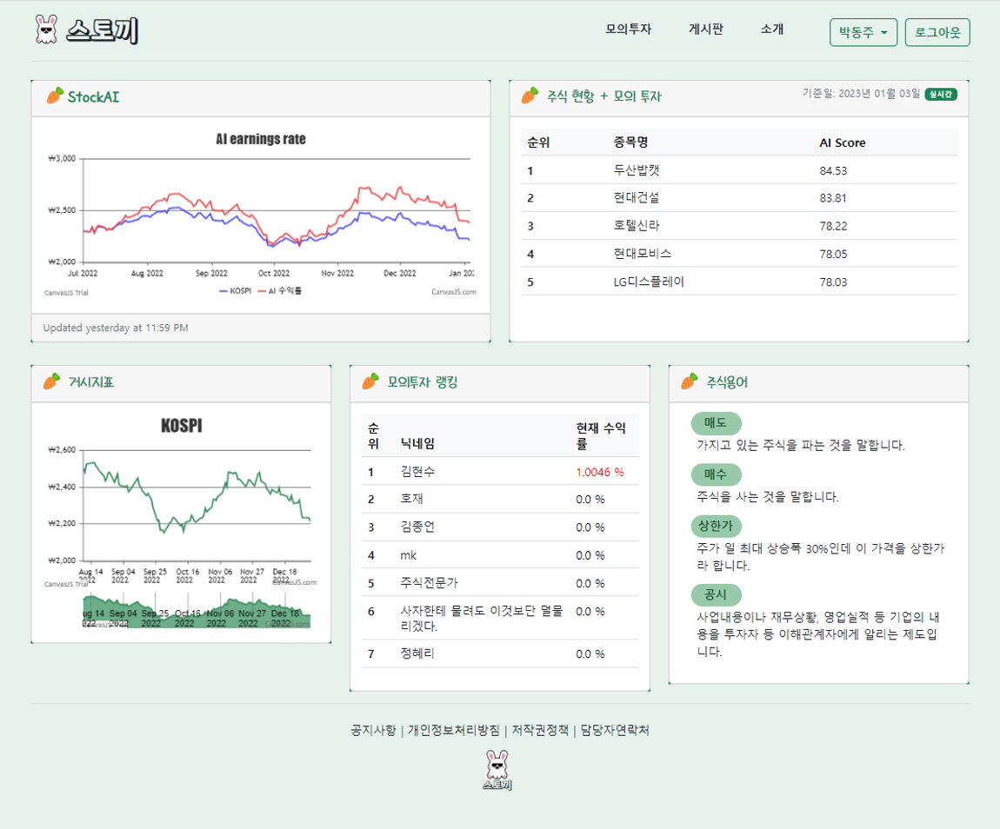
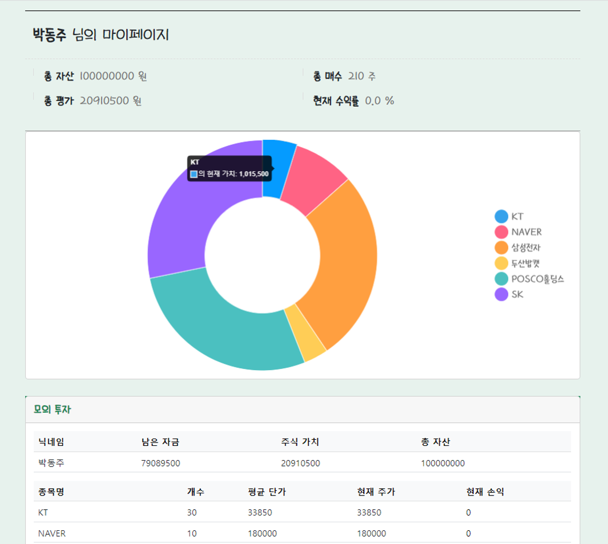
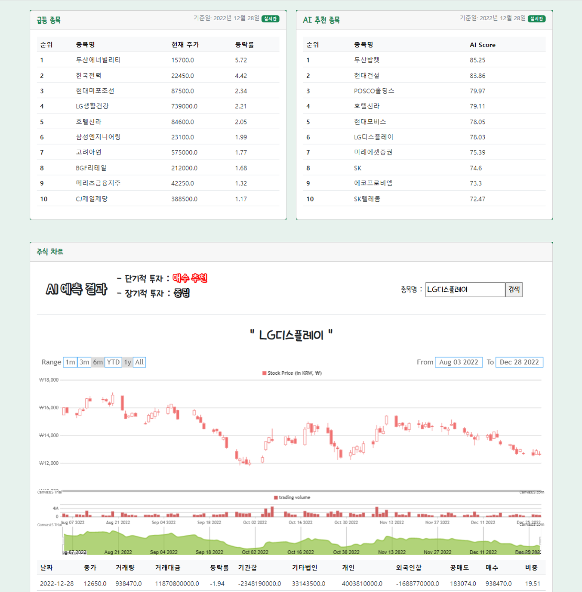
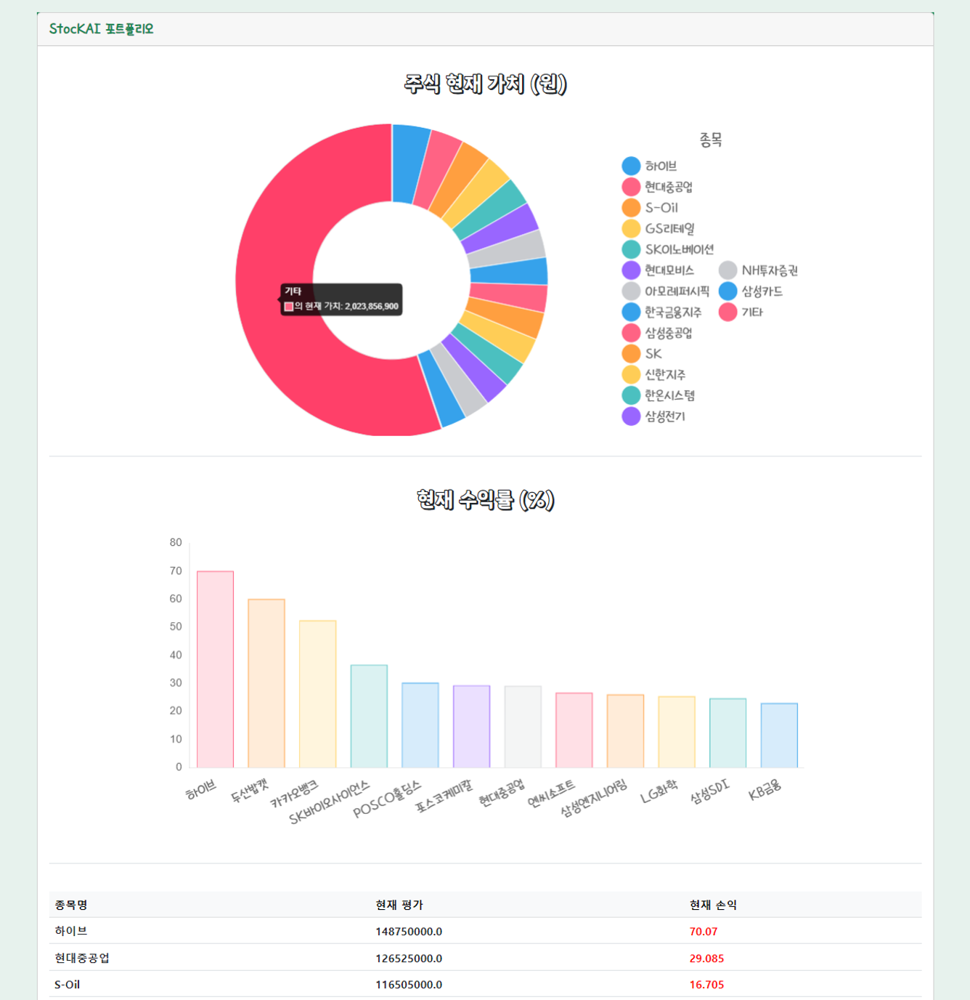
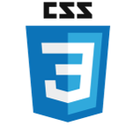

# **0. 팀원 소개**

 [ 접기 / 펼치기 버튼 ] 

&nbsp;

- 김창준
    - 역할 : DB, AWS, 데이터 수집 및 적재

- 김현수
    - 역할 : Backend, git 관리

- 문준수
    - 역할 : AI, 데이터 수집 및 처리

- 박동주
    - 역할 : Backend, 웹 총괄

- 이동비
    - 역할 : 팀장, AI, AWS, 데이터 수집 및 처리

- 이형찬
    - 역할 : Frontend, 웹 디자인

- 정주원
    - 역할 : Frontend, 웹 디자인

&nbsp;

# **1. 프로젝트 소개**

### **스토끼(StocKAI)**
모의투자와 AI로 누구나 쉽게 주식 투자에 대한 지식과 경험을 쌓을 수 있는 플랫폼

✔ **개발배경**
- 코로나19 이후 사람들의 주식에 대한 관심도가 높아짐. 이러한 유행 속에서 주식과 관련된 AI 서비스들이 많이 선보였지만, 대부분 서비스 요금을 지불해야 하거나 입문자를 고려했을 때 주가 정보나 용어 습득의 어려움이 있었음

    - 기존 서비스 보다 간편하고 지식 습득이 용이해야 함
    - 입문자의 진입 장벽을 낮추기 위한 모의투자 서비스를 제작
    - 주식을 분석하고 주가를 예측하는 AI를 제작하여 사용자에게 종목 추천  

✔ **대상**
- 주식 투자 입문자 및 주식에 관심이 있는 사람 모두 

&nbsp;

# **2. 아키텍처**

- 2-Tier

<!-- </img> -->

&nbsp;

# **3. DB**

- ERD

<!-- </img> -->

>- **주식 데이터**
>    - StockData : 종목 데이터
>    - MacroeconomicIndicators : 거시지표 데이터
>- **AI 예측 결과**
>    - ModelResult : 자체제작 모델 예측결과 저장
>    - StockCode : 종목이름,코드와 종목별 모델 정확도 저장
>    - AIRate : AI모의투자 결과 저장
>    - AIFunds : AI모의투자 현재 자금 저장
>- **사용자 데이터**
>    - UserData : 사용자 정보 저장
>    - UserStock : 사용자 주식 현황 저장
>- **그 외(게시판, 용어사전)**
>    - Message : 게시판 글 저장
>    - Comment : 댓글 저장
>    - Dictionary : 주식 용어 저장

- **갱신 주기**
    - day : StockCode 외의 모든 테이블
    - week : StockCode

&nbsp;

# **4. 웹 구성도**

#### Flow
- **초기 시작** : Intro > 메인 화면 > 회원가입 > 로그인
- **모의 투자** : 메인 화면 > 주식현황 + 모의투자
- **AI 포트폴리오** : 메인화면 > StocKAI
- **보유 주식 현황** : 메인화면 > 마이페이지

&nbsp;

# **5. 데이터 파이프라인**

- 일괄처리(batch processing) 데이터 파이프라인 구성
    - 데이터 수집 -> 데이터 처리 -> 검증 -> DB 적재 -> web서비스 동기화

&nbsp;

# **6. AI 모델**

&nbsp;

# **7. UI / UX**

| 메인 페이지 | 마이 페이지 |
| :-----: | :-----: |
|  |  |

| 주식현황 + 모의투자 | AI 포트폴리오 |
| :-----: | :-----: |
|  |  |

&nbsp;

# **8. 데모**

http://3.35.230.74:8000/welcome/
- 서버비 문제로 2023-01-12 서버를 종료하였습니다.

&nbsp;

# **9. 개발환경 및 데이터 출처**

- Front

| HTML | CSS | JavaScript | BootStrap5 |
| ---- | --- | ---------- | ---------- |
|  |  |  |  |

- Backend

| Python | Django | Django REST | MySQL |
| ------ | ------ | ----------- | ----- |
| <middle></middle> |  |  |  |

- Data Pipeline & AI

| beautifulsoup | pandas | konlpy | sklearn | tensorflow |
| --- | --- | ------ | ------- | ---------- |
|  |  |  |  |  |

- Cloud Server

| AWS | ubuntu |
| --- | --- |
|  |  |

<!-- </img> -->
<!-- </img> -->
